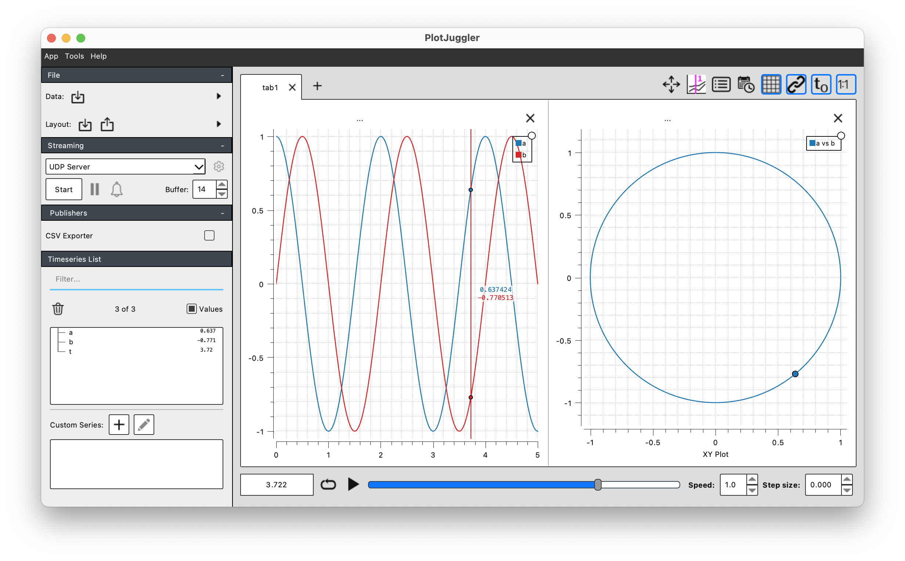

# PlotJuggler

[](https://pbouffard.github.io/PlotJuggler.jl/stable/)
[](https://pbouffard.github.io/PlotJuggler.jl/dev/)
[](https://github.com/pbouffard/PlotJuggler.jl/actions/workflows/CI.yml?query=branch%3Amain)
[](https://codecov.io/gh/pbouffard/PlotJuggler.jl)

A package for getting timeseries plots out of your Julia session and into [PlotJuggler](https://github.com/facontidavide/PlotJuggler) *fast*. It doesn't so much *solve* the Time to First Plot issue but does work around it for very basic use cases that correspond well to (some of) PlotJuggler's capabilities.

## Features
* Very fast way to just get a simple plot onto the screen.
* Really simple syntax - (ab)use NamedTuples to have plot curve names take on names of variables in local workspace

## Usage
Note that the package assumes you have the `plotjuggler` binary in your `PATH`.

### Time Series
```
using PlotJuggler

t = 0:0.01:5
a = cos.(2*pi*t)
b = sin.(2*pi*t)

# Plot a and b vs. t, labeled:
pjplot(t, (; a, b))

# Plot a and b vs. t, labeled automatically as data1 and data2:
pjplot(t, [a, b])

# Plot a vs. t, where t is automatically set to 1:length(a)
pjplot(a)

```


### Time Series + XY Plot
The optional `xy` argument can be set to include an XY plot of 2 of the variables. The same NamedTuple trick is used to minimize typing. Note that for now it's required that the time history plots include the vectors to be used in the XY plot, and the 'anonymous' forms do not support XY plotting:

```
pjplot(t, (; a, b); xy=(; a, b))
```



## How it works
Very hackily, honestly. The provided data gets written to a CSV file, and the curve names are used to write a PlotJuggler layout XML file. These are passed to PlotJuggler using commandline arguments.

## What it's not
This isn't meant to be a replacement for things like [Plots.jl](https://docs.juliaplots.org/stable/) or [Makie](https://makie.juliaplots.org/stable/) which are what you should use if a lot of customization is required. On the other hand, it might be nice to make PlotJuggler an available backend for Plots.jl, though it would only be able to support a fairly limited subset vs. the other backends.

## Known Issues/Limitations
* The CSV Loader dialog pops up asking to select the X axis column, just hit Enter to take the default of t. This appears to be a PlotJuggler bug, as the XML layout file does contain this information and [supposedly](https://github.com/facontidavide/PlotJuggler/issues/129#issuecomment-457650629) this should prevent the popup.
* Each invocation starts a brand new PlotJuggler process.
* Only a basic layout of a single tab with a single axis containing 1 or more curves plotted against time is supported. I have notional plans to improve this such that multiple axes are generated based on nested vectors, e.g. `pjplot(t, [(; a, b], c)]` would give you 2 stacked plots, with `a` and `b` plotted against time in the top plot and `c` vs time in the bottom one.
* XY plots aren't supported. Need to think about a nice simple syntax for this.
* Since `which` is used to locate the `plotjuggler` binary this probably means it won't work on Windows, though probably fixing this is easy.
* Many other features of PlotJuggler aren't supported, e.g. streaming data. It should be possible to add such features though.
