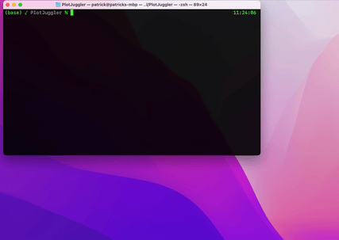

# PlotJuggler

[](https://pbouffard.github.io/PlotJuggler.jl/stable/)
[](https://pbouffard.github.io/PlotJuggler.jl/dev/)
[](https://github.com/pbouffard/PlotJuggler.jl/actions/workflows/CI.yml?query=branch%3Amain)
[](https://codecov.io/gh/pbouffard/PlotJuggler.jl)

A very basic package for getting timeseries plots out of your Julia session and into [PlotJuggler](https://github.com/facontidavide/PlotJuggler) *fast*.

## Features
* Very fast way to just get a simple plot onto the screen
* Really simple syntax - (ab)use NamedTuples to have plot curve names take on names of variables in local workspace

## Usage
```
t = 0:0.01:5
a = cos.(2*pi*t)
b = sin.(2*pi*t)

pjplot(t, (; a, b))

```



## How it works
Very hackily, honestly. The provided data gets written to a CSV file, and the curve names are used to write a PlotJuggler layout XML file. These are passed to PlotJuggler using commandline arguments.

## Known Issues
* The CSV Loader dialog pops up asking to select the X axis column, just hit Enter to take the default of t